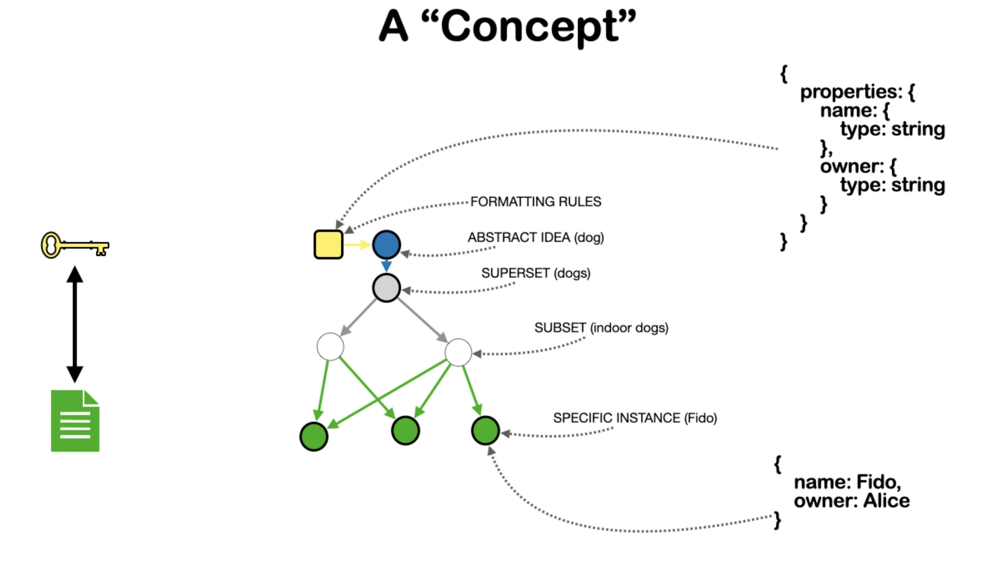

concept
======

A concept is defined as a collection of nodes and edges, formed from a single class node, taking all class threads emanating from that node (all nodes and edges contained within those threads). (Is property tree added to the definition of the concept?)

